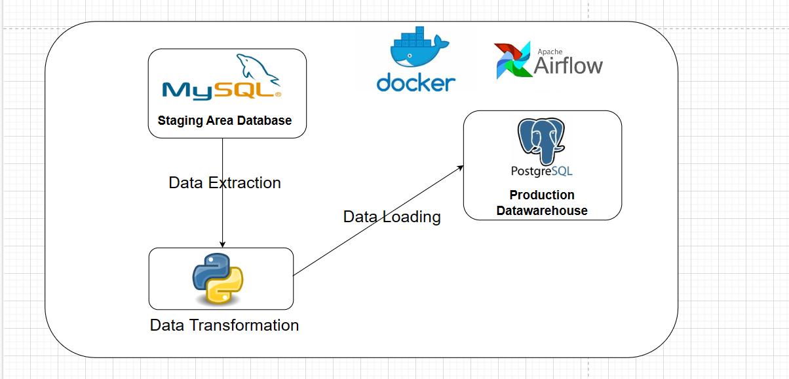

# ETL with Airflow

This Airflow ETL pipeline is designed  to efficiently extract data from a MySQL staging area and seamlessly load it into a production PostgreSQL data warehouse. Configured to run every 2 minutes, the pipeline diligently monitors the MySQL staging database for any fresh rows. Upon detection, it performs a slight transformation before appending the data to the PostgreSQL data warehouse. Specifically, a timestamp column is incorporated for each row destined for the final data warehouse, enhancing data traceability and temporal context within the warehouse.
<br>

# Project Overview



# Project Details
0- create a log directory in the src folder for the dag logs

1- Run the sales.sql script in MySQL Workbench to create and populate the necessary table in the MySQL staging database.

2- Execute the postgresqlconnect.py script to create and initialize the Data Warehouse schema and table in PostgreSQL.

3- Finally, compose up the yaml file so that you can run the DAG (Directed Acyclic Graph) script to automate the ETL job using Airflow. This DAG script will contain the tasks for extracting data from the MySQL staging database, transforming it if necessary, and loading it into the PostgreSQL Data Warehouse. The DAG will be scheduled to run at the desired intervals every 2 minutes.


## Software requiremnts:
- Docker 
- Python(3.10+)


#### Install Python using MiniConda

1) Download and install MiniConda from [here](https://docs.anaconda.com/free/miniconda/#quick-command-line-install)
2) Create a new environment using the following command:
```bash
> conda create -n airflow_etl python=3.10
```
3) Activate the environment:
```bash
> conda activate airflow_etl
```


## Installation

### Install the required packages

```bash
> pip install -r requirements.txt
```
<br>


### Setup the environment variables

```bash
> copy .env.example .env
```

## Connect and Collaborate

Feel free to connect and collaborate on [LinkedIn](https://www.linkedin.com/in/mohamed-afkir-1bbb9729a)<br>
or contact me via [email](mailto:mohamedafkir078@gmail.com)

